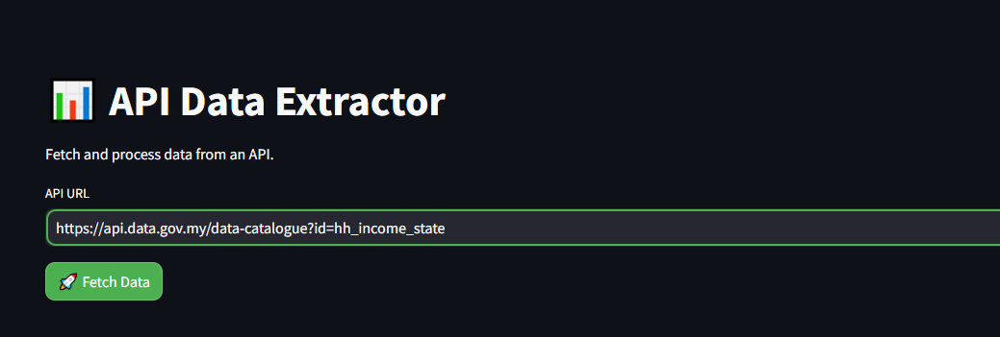
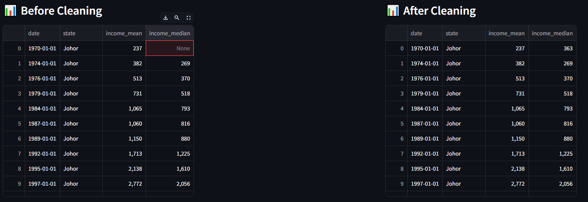
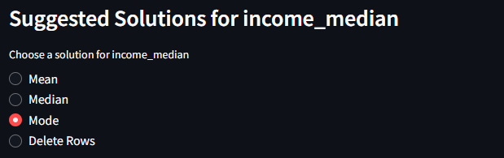
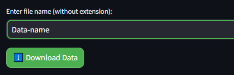

# Overview
The API Data Extractor is a simple Streamlit-based web application build with python that allows users to fetch, process, and clean data from an API. The application performs data cleaning, handles missing values, and provides a user-friendly interface to download the cleaned dataset.

## Live Demo  
[Try it on Streamlit](https://api-data-extraction.streamlit.app/)  

## API Example  
This app has been tested with the following API:  
[Data.gov.my API Catalogue](https://data.gov.my/data-catalogue)

# Features:
- Fetch data from an API.
- Process and clean the data by renaming columns and handling missing values.
- Compare before and after cleaning side-by-side.
- Provide suggestions for missing values using Mean, Median, Mode, or Deletion.
- Download the cleaned data as a CSV file for further analysis in Power BI or Excel.

# Tools used
- Python
- Streamlit
- Pandas
- Request

# Structures
- API-DATA.py: Source code with explanation
- assets: Screenshots of how the application works

# How It Works

| Step | Description | Image |
|------|------------|-------|
| 1️⃣ | Enter the API URL |  |
| 2️⃣ | A side-by-side comparison of the original and cleaned data is displayed |  |
| 3️⃣ | If missing values are found, suggested solutions will appear |  |
| 4️⃣ | Enter a custom file name and click "Download" to save the dataset |  |

